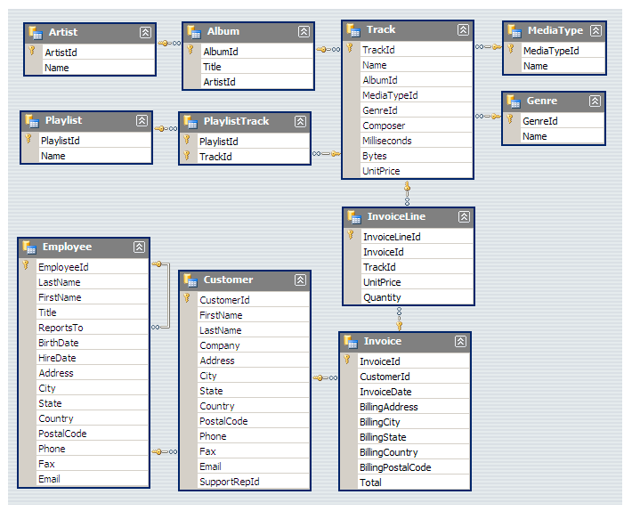

# 🎵 Music Store Data Analysis — PostgreSQL

A SQL-based data analysis project using PostgreSQL to explore customer behavior, sales performance, music preferences, and country-level purchasing patterns for a digital music store.

## 🎯 Project Objective

The objective of this project is to analyze a relational music store database and answer business-oriented questions using SQL.

The analysis focuses on:

- Customer purchasing behavior
- Sales and invoice performance
- Customer spending patterns
- Music genre popularity
- Artist performance
- Track characteristics
- Country-level purchasing trends
- Employee hierarchy

## 🛠️ Tools & Technologies

| Category | Tools / Skills |
|---|---|
| Database | PostgreSQL |
| SQL Environment | pgAdmin 4 |
| Query Language | SQL |
| Data Analysis | Aggregation, Filtering, Grouping |
| Data Retrieval | Joins, Subqueries |
| Advanced SQL | CTEs, Window Functions |
| Analysis | Customer, Sales & Music Trends |

## 🗂️ Database Structure

The project works with a relational music store database containing entities such as:

- Customer
- Invoice
- Invoice Line
- Track
- Album
- Artist
- Genre
- Employee

These tables are connected through relational keys and are queried together to answer business questions.

## 🔎 Analysis Performed

### 1. Basic Business Analysis

- Identified the senior-most employee based on job title hierarchy
- Analyzed invoice distribution by country
- Identified the top 3 invoice values
- Identified the city generating the highest total invoice value
- Identified the highest-spending customer

### 2. Customer & Music Analysis

- Identified customers listening to Rock music
- Analyzed the top Rock artists by number of tracks
- Identified tracks longer than the average track duration
- Analyzed customer spending associated with the best-selling artist

### 3. Advanced SQL Analysis

- Identified the most popular music genre for each country
- Analyzed country-level purchasing patterns
- Identified the highest-spending customer in each country
- Used alternative query approaches for country-level analysis
- Handled country-level ranking and maximum-value analysis

## 💡 Business Questions

This project uses SQL to answer questions such as:

1. Which customers generate the highest revenue?
2. Which countries have the highest invoice activity?
3. Which cities generate the highest total invoice value?
4. Which music genres are most popular across different countries?
5. Which artists have the highest number of Rock tracks?
6. Which customers spend the most within each country?
7. Which tracks have above-average durations?
8. What customer and purchasing patterns can be identified from the database?

## 🧠 SQL Concepts Demonstrated

- SELECT
- WHERE
- ORDER BY
- GROUP BY
- LIMIT
- Aggregate Functions
- INNER JOIN
- DISTINCT
- Subqueries
- Common Table Expressions (CTEs)
- Window Functions
- ROW_NUMBER()
- Ranking
- Country-level Aggregation
- Customer Analysis
- Sales Analysis

## 📁 Project Structure

PostgreSQL-Music-Store-Analysis
│
├── README.md
├── sql/
│   └── music_store_analysis.sql
│
└── Music_Store_database.sql

## 🗃️ Database Schema

The project uses a relational database structure connecting customers, invoices, tracks, albums, artists, genres, employees, and related entities.

The schema helps illustrate the relationships between the tables used throughout the analysis.

## 📋 Analysis Questions

The project is structured around business questions covering three levels of SQL analysis:

- **Easy:** Invoice analysis, customer spending, country-level invoice activity, and sales by city
- **Moderate:** Rock music listeners, Rock artists, and above-average track duration
- **Advanced:** Customer spending by artist, popular genres by country, and highest-spending customers by country

The complete set of analysis questions is available in the project documentation:

[View Analysis Questions](docs/Music%20Store%20Analysis-Questions.pdf)

## 📌 Project Type

**Data Analytics | SQL | PostgreSQL | Relational Database Analysis**

## 👩‍💻 Author

**Bhavya Verma**

GitHub: [@Rumi004](https://github.com/Rumi004)
